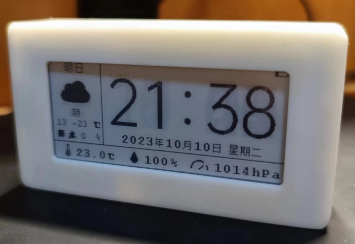

# SmartClock: A simple but powerful desktop gadget

## Features
- 2.9 "ink screen, excellent viewing Angle and very low power consumption, and can be displayed all the time. 
- Automatic network time synchronization ensures that the time is always accurate. 
- Supports monitoring of environmental information, including temperature, humidity, and air pressure. 
- Switch to Pomodoro Timer at any time to make work and study more efficient. 
- Get weather conditions through the network, showing tomorrow's weather and precipitation probability
- Can be powered by a built-in battery for 7 days, using the universal USB-C charging port 
- Compact and portable, you can take it anywhere. 

## Making Guidelines 
There are the following folders in this project: 
- Hardware
- Model
- bin
- GUI_Picture
- src 

The following will show you how to make a SmartClock by explaining what the files in these folders do.

### Hardware 
In the Hardware folder, you can see the following two types of files: 
- **Compressed package beginning with Gerber_PCB:** These are the production files of the circuit board. You need to provide these two files to the corresponding circuit board manufacturer to make the circuit board used in this project.
- **PDF file beginning with Schematic:** This is the schematic diagram of the circuit board to help you understand the composition of the circuit. 

**Please note**: when you complete the circuit board, you also need to weld the corresponding components according to the schematic diagram before it can work normally. 

This project contains two circuit boards. In order to save internal space, you need to use the I2C interface as shown in the following picture, and use 2.54mm row pin connectors to stack them vertically in the order of "MainBoard" below and "PCF8563_RTC" above: 

### Model
This is the 3D design file of the SmartClock shell, if you need a shell for it, please use a 3D printer to print two files, they are the front shell and the back. 

### bin
This is the compiled firmware, and when you finish the circuit, you can use the serial port on the board to write the firmware to it. (PS. The main control chip uses ESP8266, you can find the corresponding finish firmware tutorial on the Internet yourself). 

**However, it is recommended that you build your own firmware instead of using the compiled firmware provided.** Because the weather service API used in the firmware has a free limit, it is not guaranteed to be available at any time. The following will tell you how to compile your own firmware: 
- Register your own account in the https://www.seniverse.com/, and find your API KEY in the console. 
- Open the `Weather` file in the root directory of this project, The ninth line `String httpRequest = "http://api.seniverse.com/v3/weather/daily.json?key=[YOURKEY]&location=ip&language=en`. Change the **YOURKEY** to your API KEY. 
- Download the Arduino on your computer and enter the following in the Additional boards manager URLs in the preferences: `https://arduino.esp8266.com/stable/package_esp8266com_index.json`
- Then follow the image below to locate the Boards Manager：
    
- Search for esp8266 and install the appropriate toolkit
- Install the following Libraries by searching for `arduinojson` in the Tools-Manage libraries: 

    
- Open the `SmartClock.ino` file in the root directory of the project using Arduino
- Connect the board to your computer using a serial port, compile it using Arduino and upload the firmware to the board you made

### GUI_Picture
The source file that draws the image displayed on the screen, you do not need to change it. 

### src 
The underlying drivers, such as screen display, sensor, Wifi management, RTC time management, etc., you do not need to modify them. 

## Use Guidelines
- If there are no problems with your hardware and firmware, follow the on-screen instructions to connect the device to your WIFI after you turn it on
    - Tip: 
    If you see the following information, you may have a problem with your hardware, do a hardware check: 

    
- If all goes well, you'll end up in the main screen as shown at the beginning of the README. In this interface, turn the device **upside down** to enter Pomodoro Timer mode. 

     

- You can exit the mode and return to the main screen by flipping the device back to its original position. 
